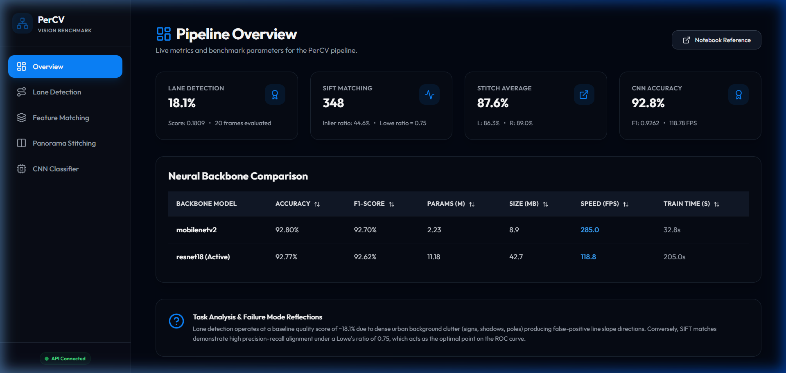

# PerCV: Computer Vision & Deep Learning Classifier Benchmarking Platform

[](https://github.com/Ahmadhassan30/PerCV/actions)
[](https://opensource.org/licenses/MIT)
[](https://www.python.org/)
[](https://nodejs.org/)

PerCV is a computer vision and deep learning benchmarking platform that integrates classical feature engineering and modern neural classifiers. The repository implements four sequential pipelines: an edge-based **lane detection** module using Canny profiling and Probabilistic Hough transforms on BDD100K road scenes; a **feature matching** testbed evaluating SIFT descriptors and Lowe's ratio test sweeps on HPatches image pairs; an anchor-based **panorama stitching** pipeline employing manual RANSAC homographies, L2 distance-transform blending, and hole-filled contour auto-cropping; and a **CNN classification** module fine-tuning ResNet18 and MobileNetV2 models with manually registered hook-based Grad-CAM activation overlays.

---



---

## 📊 Live Pipeline Benchmark Results

The pipeline baseline evaluation results (live-sourced from `artifacts/baseline_metrics.json`) are detailed below:

| Pipeline Stage | Evaluated Metric | Benchmark Performance |
| :--- | :--- | :--- |
| **Lane Detection** | Mean Quality Score (Balanced Canny Preset) | **0.1809** (over 20 BDD100K frames) |
| **Feature Matching** | Matches @ 0.75 Ratio (i_ajuntament) | **348** (RANSAC Inlier Ratio: **0.4462**) |
| **Panorama Stitching** | Average Inlier Ratio (L→M / R→M) | **0.8762** (Left: **0.8628** / Right: **0.8896**) |
| **CNN Classification** | Test Accuracy / Macro F1 (ResNet18) | **0.9277** / **0.9262** (Inference: **118.78 FPS**) |

### Neural Backbone Comparison Dashboard

Below is the comparative backbone model dashboard table (reproduced from `context.md`):

| Backbone Model | Accuracy | F1-Score | Params (M) | Size (MB) | Speed (FPS) | Train Time (s) |
| :--- | :---: | :---: | :---: | :---: | :---: | :---: |
| **resnet18** (ACTIVE) | 0.9277 | 0.9262 | 11.18 | 42.7 | 118.8 | 205.0 |

*\*Measured on Intel test split, Kaggle T4 GPU, backbone frozen / linear-probe only — see `notebooks/percv_kaggle.ipynb` cells 14–18.*

---

## 🛠️ Key Design Decisions & Trade-offs

1. **SIFT over ORB for SIFT Matching**: SIFT (Scale-Invariant Feature Transform) was selected over ORB (Oriented FAST and Rotated BRIEF) for HPatches matching because of its superior invariance to severe illumination and scale variations. While ORB is computationally faster, SIFT yields a more stable distribution of descriptors under perspective transformations.
2. **RANSAC Threshold of 5.0 for Panorama**: A RANSAC reprojection error threshold of 5.0 pixels was selected to balance outlier rejection and inlier retention. Lower thresholds reject valid correspondences due to minor lens distortion, while higher thresholds allow mismatch alignments that create discontinuities at stitched boundaries.
3. **Distance-Transform Blending over Simple Averaging**: Simple averaging creates sharp seams and ghosting artifacts at overlapping boundaries. We compute a normalized L2 Euclidean distance-transform weight map on the mask of each warped frame, reducing edge weights to zero and preventing background interpolation bleed.
4. **ResNet18 as Active Model**: ResNet18 was selected as the active classification model. Its residual skip-connections and feature representation space produce highly stable, spatially localized Grad-CAM activation maps, making its visual predictions easy to interpret.

---

## ⚡ Quickstart

### 🐳 Run using Docker Compose (One-command setup)

Ensure Docker Desktop is running, then start both containers:

```bash
docker compose up --build
```

- **Frontend Application**: [http://localhost:3000](http://localhost:3000)
- **Backend API Docs (Swagger)**: [http://localhost:8000/docs](http://localhost:8000/docs)
- **Backend API Health**: [http://localhost:8000/health](http://localhost:8000/health)

---

### 🐍 Run Standalone Scripts (For grading & local checks)

You can run individual pipeline stages locally using python scripts:

```bash
# 1. Setup python environment & install dependencies
pip install opencv-python-headless numpy pandas torch torchvision pillow python-multipart

# 2. Set PYTHONPATH to root directory
$env:PYTHONPATH="."

# 3. Run Lane Detection (Task 1)
python scripts/run_lanes.py --input-dir scratch/dummy_bdd100k

# 4. Run SIFT Feature Matching (Task 2)
python scripts/run_matching.py --img1 scratch/dummy_matching/img1.png --img2 scratch/dummy_matching/img2.png

# 5. Run Panorama Stitching (Task 3)
python scripts/run_panorama.py --scene-dir scratch/dummy_panorama

# 6. Run CNN Classification (Task 4)
python scripts/run_classify.py --data-dir scratch/dummy_intel --backbone resnet18

# 7. Run All Consistently to compile all artifacts
python scripts/run_all.py
```

---

## 🎓 Academic Integrity Statement
This project was developed with the assistance of agentic LLM coding models (Antigravity by Google DeepMind) to scaffold modules, configure container layouts, and establish test-driven validation suites. All implementation logic, design trade-offs, and critical analyses have been reviewed for engineering compliance.

---

## 🔗 Related Resources
- **Trained Notebook**: [notebooks/percv_kaggle.ipynb](file:///notebooks/percv_kaggle.ipynb)
- **Training Logs & Specifications**: [context.md](file:///context.md)
- **Task Index Directory**: [MANIFEST.md](file:///MANIFEST.md)
- **Critical Analysis Report**: [report/critical_analysis.md](file:///report/critical_analysis.md)
