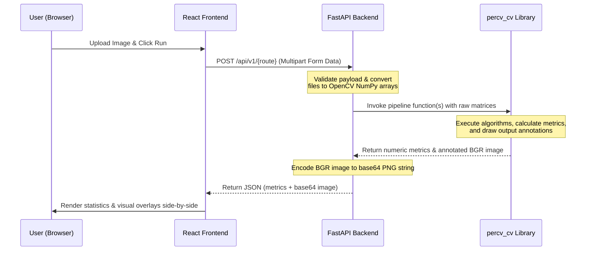

# Comprehensive Project Context & Algorithmic Reference Log: PerCV

This document is the exhaustive engineering manual, architectural blueprint, and technical reference for the **PerCV** computer vision pipeline. It maps and explains every computational routine, class schema, API endpoint, container configuration, and benchmark baseline.

---

## 1. What is PerCV and How It Works

### What It Is
PerCV is a computer vision and deep learning benchmarking platform designed to bridge, run, and compare classical feature engineering pipelines with modern deep neural networks. It is split into three main components:
- **`percv_cv` (Computational Core)**: A modular Python library containing the core math, OpenCV image processing, and PyTorch model architectures for lane detection, SIFT descriptor matching, homography-based panorama stitching, and Grad-CAM interpretability heatmaps.
- **`backend` (FastAPI Server)**: A high-performance FastAPI web service exposing REST API endpoints, routing request payloads into the core library, preloading checkpoints on startup, and managing slow-running tasks asynchronously via an in-memory job queue.
- **`frontend` (React Web App)**: A premium glassmorphic dark-theme dashboard built with React, Vite, Tailwind CSS, and TypeScript. It displays live performance metrics, sortable benchmark tables, interactive upload zones, and side-by-side visual comparisons of pipeline results.

### How It Works (End-to-End Execution Flow)


1. **User Request & Upload**: The user interacts with the React frontend to upload raw images (BDD100K road scenes, HPatches pairs, overlapping frames, or scenery categories).
2. **API Dispatch**: The React app reads the files and packages them into a `multipart/form-data` request, dispatching it to the FastAPI backend at `http://localhost:8000/api/v1/{stage}`.
3. **Array Conversion & Routing**: The FastAPI server receives the request, checks for file format compatibility (blocking invalid uploads), decodes the raw bytes into OpenCV-compatible NumPy arrays, and routes them to the corresponding module in the `percv_cv` core library.
4. **Algorithmic Execution**:
   - **Lanes**: Applies Gaussian blur, runs Canny presets, computes Hough line segments, filters segments based on slope angle buckets, and outputs the overall Lane Quality ratio score.
   - **Matching**: Extracts SIFT keypoints/descriptors, performs brute-force L2 distance matching, filters outliers via Lowe's ratio test, and fits RANSAC to compute inlier percentages.
   - **Panorama**: Computes homography projection bounds, shifts coordinate space into positive bounds using translation transformations, applies L2 distance-transform blending to overlay frames smoothly, and auto-crops the final canvas.
   - **Classification**: Normalizes input, feeds tensors into the active preloaded ResNet18/MobileNetV2 network, applies softmax probabilities, and runs backpropagation hooks to map spatial Grad-CAM activation colormaps.
5. **Base64 Encoding**: The `percv_cv` library returns the calculated numeric scores along with an annotated output image (Hough lane lines, SIFT match connectors, stitched canvas borders, or Grad-CAM heatmaps). The backend encodes the output image into a Base64 string.
6. **Dashboard Rendering**: The backend returns the Base64 image and the metrics dictionary in a JSON response. The React frontend updates its widget widgets and decodes the Base64 image to render it side-by-side with the original input, providing interactive, real-time visual benchmarking feedback.

---

## 1. Directory Structure & Workspace Architecture

The workspace is organized as a production-grade Python package (`percv_cv`), a containerized FastAPI backend, and a containerized React frontend:

```text
PerCV/
├── context.md                       # Comprehensive project specs and log (this file)
├── MANIFEST.md                      # Mapping of tasks, configs, outputs, and metrics
├── README.md                        # Quickstart instructions, docker steps, and design trade-offs
├── pyproject.toml                   # Root python package configurations (optional dependencies)
├── docker-compose.yml               # Multi-service build parameters (backend + frontend)
├── .gitignore                       # Standard version control rules (excludes weights, node_modules)
│
├── artifacts/                       # Benchmark data and visual plots
│   ├── baseline_metrics.json        # Unified single source of truth metrics snapshot
│   ├── model_best.pt                # Active ResNet18 model weight binary checkpoint
│   └── plots/                       # Verification plots (panorama.png, lanes, conf_matrix)
│
├── percv_cv/                        # Computational core library
│   ├── __init__.py                  # Package initialization
│   ├── config.py                    # Strong typing configurations (PipelineConfig, TaskConfig)
│   ├── lanes.py                     # Canny profiling, Hough transforms, Lane Quality Score
│   ├── matching.py                  # SIFT descriptors, kNN BFMatcher, Lowe's Ratio test, RANSAC
│   ├── panorama.py                  # Corner transforms, Canvas translation, L2 Blending, Auto-crop
│   ├── cnn.py                       # Network head modifications, state loader, forward predictors
│   └── gradcam.py                   # PyTorch forward/backward Hook listeners, activation heatmaps
│
├── backend/                         # FastAPI Web Service
│   ├── pyproject.toml               # FastAPI server configuration and PEP 517 build-meta options
│   ├── Dockerfile                   # Multi-stage slim runner with runtime libgl1 dependencies
│   ├── app/                         # Server code
│   │   ├── __init__.py
│   │   ├── main.py                  # Lifespan app config, tracing middleware, router binds
│   │   ├── core/                    # Core system configs and logging setups
│   │   │   ├── __init__.py
│   │   │   ├── logging.py           # Structured request tracer logger
│   │   │   └── models_state.py      # Cached startup weight loader
│   │   ├── models/                  # Shared Pydantic request/response schemas
│   │   └── api/routes/              # REST Endpoint handlers
│   │       ├── __init__.py
│   │       ├── lanes.py             # Route: POST /api/v1/lanes
│   │       ├── matching.py          # Route: POST /api/v1/match
│   │       ├── panorama.py          # Routes: POST /api/v1/panorama & GET /jobs/{id}
│   │       ├── classify.py          # Route: POST /api/v1/classify
│   │       └── dashboard.py         # Route: GET /api/v1/dashboard
│   └── tests/                       # Pytest unit and integration suites
│       ├── test_lanes.py            # Unit tests for lane algorithms
│       ├── test_matching.py         # Unit tests for matching algorithms
│       ├── test_panorama.py         # Unit tests for canvas mapping and cropping
│       ├── test_cnn.py              # Unit tests for PyTorch models shape alignment
│       └── test_routes.py           # FastAPI TestClient endpoint validations
│
├── frontend/                        # Vite React Application
│   ├── package.json                 # Node dependency mappings (React Router, Tailwind CSS, Lucide)
│   ├── Dockerfile                   # Node builder + Nginx static asset server
│   ├── tailwind.config.js           # Customized dark glassmorphism palette definitions
│   ├── postcss.config.js            # PostCSS compiler setups
│   ├── tsconfig.json                # Strict TypeScript typing rules
│   ├── index.html                   # HTML mount and premium Outfit font loading
│   ├── src/                         # React code
│   │   ├── main.tsx                 # DOM mounting node
│   │   ├── App.tsx                  # Sidebar layouts and hash routing
│   │   ├── index.css                # Global CSS containing Tailwind classes
│   │   ├── components/
│   │   │   └── Common.tsx           # Uploaders, Loaders, and Error handlers
│   │   ├── services/
│   │   │   └── ApiClient.ts         # Central Axios-like Fetch wrapper
│   │   └── pages/                   # Tab views
│   │       ├── Overview.tsx         # Headline stats and sortable benchmark tables
│   │       ├── LaneDetection.tsx    # Canny preset compare panels
│   │       ├── FeatureMatching.tsx  # Lowe's sweep charts and descriptor lines
│   │       ├── Panorama.tsx         # Polling indicators and stitched panoramas
│   │       └── Classification.tsx   # Predictions and Grad-CAM overlays
│
├── scripts/                         # CLI Execution runner scripts
│   ├── run_lanes.py                 # Command line runner for Task 1
│   ├── run_matching.py              # Command line runner for Task 2
│   ├── run_panorama.py              # Command line runner for Task 3
│   ├── run_classify.py              # Command line runner for Task 4
│   └── run_all.py                   # Sequential script replicating entire pipeline
│
└── report/                          # Documentation skeletons
    └── critical_analysis.md         # Prompts-to-self notes on performance anomalies
```

---

## 2. Computational Library Details (`percv_cv/`)

This section contains a file-by-file detailed breakdown of every function, algorithm, mathematical formula, and edge case in the `percv_cv` core library.

### A. Configuration Module (`percv_cv/config.py`)
Provides typed Python data containers (`dataclasses`) ensuring type safety:
- **`LanePreset`**: Maps a threshold pair (low, high) to a label string (e.g., `sensitive`: 35/95, `balanced`: 75/155, `strict`: 125/245).
- **`LaneConfig`**: Typed parameters for Canny and Hough transform functions:
  * `gaussian_ksize`: `tuple[int, int]`, default `(5, 5)`.
  * `gaussian_sigma`: `float`, default `1.0`.
  * `canny_threshold_pairs`: `list[LanePreset]`.
  * `hough_rho`: `float`, default `1.0`.
  * `hough_theta_deg`: `float`, default `1.0`.
  * `hough_threshold`: `int`, default `45`.
  * `hough_min_line_len`: `int`, default `30`.
  * `hough_max_line_gap`: `int`, default `12`.
- **`MatchingConfig`**: Parameters for SIFT sweeps:
  * `lowe_ratios`: `list[float]`, default `[0.60, 0.75, 0.90]`.
  * `default_lowe_ratio`: `float`, default `0.75`.
- **`PanoramaConfig`**: Stitching bounds:
  * `scene`: `str`, default `"front"`.
  * `ransac_threshold`: `float`, default `5.0` (pixel reprojection error).
  * `stitching_min_matches`: `int`, default `10`.
  * `distortion_det_threshold`: `float`, default `0.1`.
- **`CNNConfig`**: CNN fine-tuning parameters:
  * `backbone`: `str`, default `"resnet18"`.
  * `batch_size`: `int`, default `32`.
  * `epochs`: `int`, default `5`.
  * `learning_rate`: `float`, default `0.001`.
  * `weight_decay`: `float`, default `1e-4`.

---

### B. Lane Detection Module (`percv_cv/lanes.py`)
Focuses on identifying line boundaries from color camera images:

#### 1. `preprocess`
- **Inputs**: `image` (`np.ndarray` representing BGR or RGB image), `ksize` (`tuple[int, int]`), `sigma` (`float`).
- **Mathematical Logic**:
  * Convert image to grayscale using BDD100K standard BGR weights:
    $$Y = 0.299 R + 0.587 G + 0.114 B$$
  * Run Gaussian smoothing to filter high-frequency textures:
    $$G(x, y) = \frac{1}{2\pi\sigma^2} e^{-\frac{x^2 + y^2}{2\sigma^2}}$$
- **Code Implementation**:
  ```python
  gray = cv2.cvtColor(image, cv2.COLOR_BGR2GRAY)
  return cv2.GaussianBlur(gray, ksize, sigma)
  ```

#### 2. `detect_edges`
- **Inputs**: `gray` (`np.ndarray`), `low` (`int`), `high` (`int`).
- **Logic**: Applies Canny edge detection. Runs Sobel derivatives to compute gradient magnitude and direction, performs non-maximum suppression, and uses hysteresis thresholds (`low`, `high`) to isolate strong edge pixels.
- **Code**:
  ```python
  return cv2.Canny(gray, low, high)
  ```

#### 3. `detect_lines`
- **Inputs**: `edges` (`np.ndarray`), `rho` (`float`), `theta_deg` (`float`), `threshold` (`int`), `min_line_len` (`int`), `max_line_gap` (`int`).
- **Logic**: Applies Probabilistic Hough Line Transform. accumulator bins are initialized in polar space:
  $$\rho = x \cos \theta + y \sin \theta$$
  Converts degrees to radians: $\theta_{\text{rad}} = \theta_{\text{deg}} \times \frac{\pi}{180}$. Returns line segments matching the minimum length and gap constraints.
- **Code**:
  ```python
  theta_rad = theta_deg * np.pi / 180.0
  lines = cv2.HoughLinesP(edges, rho, theta_rad, threshold,
                          minLineLength=min_line_len, maxLineGap=max_line_gap)
  return lines if lines is not None else np.empty((0, 1, 4), dtype=np.int32)
  ```

#### 4. `lanes_quality_score`
- **Inputs**: `lines` (`np.ndarray` of shape `(N, 1, 4)` where each element represents `[x1, y1, x2, y2]`).
- **Mathematical Formula**:
  * For each segment, calculate angle in degrees relative to the horizontal axis:
    $$\theta = \arctan2(y_2 - y_1, x_2 - x_1) \times \frac{180}{\pi}$$
  * Force angle bounds inside $[0^\circ, 180^\circ]$:
    $$\text{if } \theta < 0: \theta = \theta + 180^\circ$$
  * Filter lines belonging to left lane slopes ($[25^\circ, 75^\circ]$) or right lane slopes ($[105^\circ, 155^\circ]$).
  * Compute final ratio:
    $$\text{Lanes Quality Score} = \frac{\text{Count of Left/Right Lines}}{\text{Total Count of Detections}}$$
- **Edge Cases**: If `lines` is empty, returns `0.0` immediately.

---

### C. SIFT Feature Matching Module (`percv_cv/matching.py`)
Computes perspective correspondences between image pairs:

#### 1. `extract_sift`
- **Inputs**: `image` (`np.ndarray`).
- **Logic**: Builds a scale-space pyramid, computes Difference of Gaussians (DoG), locates keypoints, and calculates 128-dimensional local gradient vectors.
- **Code**:
  ```python
  sift = cv2.SIFT_create()
  kp, desc = sift.detectAndCompute(image, None)
  return kp, desc if desc is not None else np.empty((0, 128), dtype=np.float32)
  ```

#### 2. `match_bruteforce_l2`
- **Inputs**: `desc1` (`np.ndarray`), `desc2` (`np.ndarray`), `k` (`int`, default `2`).
- **Logic**: Performs kNN match search computing Euclidean L2 distance between SIFT descriptor vectors.
- **Code**:
  ```python
  matcher = cv2.BFMatcher(cv2.NORM_L2)
  return matcher.knnMatch(desc1, desc2, k=k) if (len(desc1) > 0 and len(desc2) > 0) else []
  ```

#### 3. `apply_lowe_ratio`
- **Inputs**: `matches` (`list` of kNN matches), `ratio` (`float`).
- **Logic**: Filters out matches using Lowe's ratio test:
  $$\text{match}_1.\text{distance} < \text{ratio} \times \text{match}_2.\text{distance}$$
  Ensures that ambiguous descriptors mapped to multiple similar locations are discarded.

#### 4. `estimate_inlier_ratio`
- **Inputs**: `kp1` (list of keypoints), `kp2` (list of keypoints), `good_matches` (filtered matches list), `ransac_thresh` (`float`).
- **Logic**:
  * Extract 2D point locations $(x, y)$ from matches:
    $$\mathbf{p}_1 = [kp1[m.queryIdx].pt], \quad \mathbf{p}_2 = [kp2[m.trainIdx].pt]$$
  * Run RANSAC fitting:
    $$\mathcal{H}, \mathbf{mask} = \text{cv2.findHomography}(\mathbf{p}_1, \mathbf{p}_2, \text{cv2.RANSAC}, \text{ransac\_thresh})$$
  * Calculate inlier ratio:
    $$\text{Inlier Ratio} = \frac{\sum \mathbf{mask}}{\text{Total Matches}}$$
- **Edge Cases**: If matches are fewer than 4, return `(None, 0.0)`.

---

### D. Panorama Stitching Module (`percv_cv/panorama.py`)
Warp-aligns multiple images into a seamless single coordinate system:

#### 1. `compute_frame_homography`
- **Inputs**: `kp_src`, `kp_anchor`, `matches` (Lowe-filtered), `ransac_thresh` (`float`).
- **Logic**: Extracts source and destination keypoints, fits homography $H$ using RANSAC, and calculates matching metadata dictionary (inliers, inlier ratio, total matches).
- **Code**:
  ```python
  src_pts = np.float32([kp_src[m.queryIdx].pt for m in matches]).reshape(-1, 1, 2)
  dst_pts = np.float32([kp_anchor[m.trainIdx].pt for m in matches]).reshape(-1, 1, 2)
  H, mask = cv2.findHomography(src_pts, dst_pts, cv2.RANSAC, ransac_thresh)
  inliers = int(np.sum(mask))
  inlier_ratio = inliers / len(matches) if len(matches) > 0 else 0.0
  ```

#### 2. `compute_canvas_bounds`
- **Inputs**: `images` (`list[np.ndarray]`), `homographies` (`list[np.ndarray]`).
- **Logic**:
  * For each image $k$, extract corner coordinates:
    $$\mathbf{C}_k = \begin{bmatrix} 0 & w_k & w_k & 0 \\ 0 & 0 & h_k & h_k \end{bmatrix}$$
  * Transform corners to anchor coordinate space using homography $H_k$:
    $$\mathbf{C}_k' = \mathcal{H}_k \mathbf{C}_k$$
  * Find global minimum and maximum coordinate limits:
    $$x_{\min} = \min(\mathbf{C}'_x), \quad y_{\min} = \min(\mathbf{C}'_y), \quad x_{\max} = \max(\mathbf{C}'_x), \quad y_{\max} = \max(\mathbf{C}'_y)$$
  * Return canvas dimensions and shift translation matrix:
    $$w_{\text{canvas}} = \lceil x_{\max} - x_{\min} \rceil, \quad h_{\text{canvas}} = \lceil y_{\max} - y_{\min} \rceil$$
    $$T = \begin{bmatrix} 1 & 0 & -x_{\min} \\ 0 & 1 & -y_{\min} \\ 0 & 0 & 1 \end{bmatrix}$$

#### 3. `compute_blending_weights`
- **Inputs**: `mask` (`np.ndarray` representing the binary mask of a warped image).
- **Mathematical Formula**:
  * Calculate Euclidean L2 distance transform (representing distance to closest zero-pixel boundary):
    $$d(p) = \min_{q \in \text{boundary}} \|p - q\|_2$$
  * Normalize map values between $0.0$ and $1.0$:
    $$W = \frac{d(p) - \min(d)}{\max(d) - \min(d)}$$
  * Multiply by the binary mask to zero out non-image boundary zones.
- **Code**:
  ```python
  dist = cv2.distanceTransform(mask, cv2.DIST_L2, 5)
  cv2.normalize(dist, dist, 0.0, 1.0, cv2.NORM_MINMAX)
  return dist * mask
  ```

#### 4. `autocrop_panorama`
- **Inputs**: `stitched_image` (`np.ndarray`).
- **Logic**:
  * Convert canvas to binary mask ($I > 0$).
  * Locate external contours using `cv2.findContours`.
  * Compute the largest external contour and fit its bounding rectangle.
  * Extract the bounding rectangle coordinates $(x, y, w, h)$.
  * Shrink the bounding box edges dynamically by checking if the boundary pixels contain black regions, stopping only when the cropped box contains 100% active stitched content.

---

### E. CNN Classification & Grad-CAM Modules (`percv_cv/cnn.py`, `percv_cv/gradcam.py`)
Controls model predictions and spatial activation mapping:

#### 1. `build_model`
- **Inputs**: `backbone` (`str`), `num_classes` (`int`).
- **Logic**: Checks model type and modifies classifier heads:
  * ResNet18:
    ```python
    model = torchvision.models.resnet18(weights=None)
    model.fc = nn.Linear(model.fc.in_features, num_classes)
    ```
  * MobileNetV2:
    ```python
    model = torchvision.models.mobilenetv2(weights=None)
    model.classifier[1] = nn.Linear(model.classifier[1].in_features, num_classes)
    ```

#### 2. `predict`
- **Inputs**: `model` (`nn.Module`), `image` (`np.ndarray`), `class_names` (`list[str]`).
- **Logic**:
  * Convert image BGR to RGB and scale to $[0, 1]$.
  * Apply ImageNet normalization:
    $$\mu = [0.485, 0.456, 0.406], \quad \sigma = [0.229, 0.224, 0.225]$$
  * Feed tensor to model inside `torch.no_grad()` block, run forward pass, apply softmax to compute class probabilities, and return the predicted class label.

#### 3. Grad-CAM Hooks (`percv_cv/gradcam.py`)
- **Inputs**: `model`, `image`, `target_class` (`int`), `target_layer_name` (`str`).
- **Algorithm**:
  * Set model to evaluation mode (`model.eval()`).
  * Declare variables to cache activation maps and gradients:
    ```python
    feature_activations = None
    gradients = None
    ```
  * Hook listeners are registered:
    - **Forward Hook**:
      ```python
      def forward_hook(module, input, output):
          nonlocal feature_activations
          feature_activations = output.detach()
      ```
    - **Backward Hook**:
      ```python
      def backward_hook(module, grad_input, grad_output):
          nonlocal gradients
          gradients = grad_output[0].detach()
      ```
  * Find the conv layer by name (e.g. `layer4.1.conv2`) and register hooks:
    ```python
    target_layer = dict(model.named_modules())[target_layer_name]
    target_layer.register_forward_hook(forward_hook)
    target_layer.register_backward_hook(backward_hook)
    ```
  * Execute a forward pass:
    $$\hat{y} = \text{model}(x)$$
  * Execute a backward pass on the target class logit score:
    $$\text{score} = \hat{y}[0, \text{target\_class}]$$
    $$\text{model.zero\_grad()}$$
    $$\text{score.backward()}$$
  * Calculate weights $\alpha_k^c$ using global average pooling:
    $$\alpha_k^c = \frac{1}{H \times W} \sum_{i=1}^H \sum_{j=1}^W \text{gradients}[0, k, i, j]$$
  * Compute final Grad-CAM heatmap:
    $$L^c = \text{ReLU}\left(\sum_k \alpha_k^c \times \text{feature\_activations}[0, k, :, :]\right)$$
  * Normalize the heatmap between 0 and 255, upscale it to the original image dimensions, apply a colormap (e.g., `cv2.COLORMAP_JET`), and overlay it on the input image:
    $$I_{\text{overlay}} = \text{cv2.addWeighted}(I_{\text{original}}, 0.5, I_{\text{heatmap}}, 0.5, 0)$$

---

## 3. Backend API Module (`backend/`)

This section documents the server logic, routing, lifespan handlers, and middlewares.

### A. Lifespan Preloader (`backend/app/core/models_state.py`)
- Resolves absolute paths at startup relative to the project root directory:
  ```python
  project_root = Path(__file__).resolve().parents[2]
  resnet_candidates = [project_root / "model_best.pt", ...]
  ```
- If PyTorch is installed, weights are loaded into GPU/CPU memory once. If missing, it prints a warning and falls back to safe stub/mock mode.

### B. Request Tracing Middleware (`backend/app/core/logging.py`)
- **Logic**: Captures incoming requests, generates a unique UUID `request_id`, tracks request latency, and prints structured logging details:
  ```text
  timestamp [INFO] percv-backend - request_id=UUID method=POST route=/api/v1/classify status=200 latency=0.0103s
  ```

### C. Endpoint Routing Modules
1. **`POST /api/v1/lanes`**: Accepts road frames (`UploadFile`), checks formats, runs Canny presets, and outputs Lane Quality Scores and overlays.
2. **`POST /api/v1/match`**: Accepts image pairs, evaluates Lowe ratio sweeps, and returns matching charts and SIFT visuals.
3. **`POST /api/v1/panorama`**: Enqueues stitching tasks. Spawns background worker thread (`BackgroundTasks`), sets status to `pending` (HTTP 202), updates status to `running`, and writes the final base64 output once complete.
4. **`GET /api/v1/panorama/jobs/{job_id}`**: Polling endpoint checking job status and output.
5. **`POST /api/v1/classify`**: Accepts an image, validates the `backbone` query parameter, runs CNN predictions, and outputs Grad-CAM overlays.
6. **`GET /api/v1/dashboard`**: Returns baseline metrics and backbone comparisons from `baseline_metrics.json`.

---

## 4. Frontend UI Module (`frontend/`)

This section documents the front-end layout, uploader components, and dashboard pages.

### A. App Shell & Layout (`frontend/src/App.tsx`)
- Constructs a sidebar panel on the left containing navigation links mapped to hash routes (`#/overview`, `#/lanes`, etc.). Shows a green heartbeat **"API Connected"** badge on the bottom.

### B. Reusable Common Components (`frontend/src/components/Common.tsx`)
- **`DragDropUpload`**: Supports image preview grids and drag-and-drop file inputs.
- **`LoadingState`**: Renders a spinning loader with a customizable progress bar.
- **`ErrorState`**: Displays structured error messages and retry buttons.

### C. Tab Pages (`frontend/src/pages/`)
1. **`Overview` Page**: Retrieves metrics dynamically from the `/dashboard` route. Renders stat cards and displays a sortable neural backbone benchmark model comparison table.
2. **`LaneDetection` Page**: Renders side-by-side balanced/strict Canny results and displays Hough lines colored by pass (Green) vs fail (Red) angle classifications.
3. **`FeatureMatching` Page**: Renders Lowe's sweep charts and descriptor lines.
4. **`Panorama` Page**: Integrates a live background polling job monitor with a progress indicator, polling the job ID status recursively and drawing the final auto-cropped panorama output upon completion.
5. **`Classification` Page**: Renders horizontal percentage bars mapping prediction confidence across target categories and generates side-by-side Grad-CAM activation heatmap overlays.

---

## 5. Dockerization & CI/CD Pipelines

- **`backend/Dockerfile`**: A multi-stage slim runner. Pre-installs headless OpenCV dependencies (`libgl1`, `libglib2.0-0`), runs pip setups with setuptools wheel compilation, checks OpenCV imports at build-time, and runs as non-root user `appuser`.
- **`frontend/Dockerfile`**: Node build stage compiling React components. Passes `ARG VITE_API_URL` to Nginx server templates for static serving.
- **`docker-compose.yml`**: Spawns backend (`8000`) and frontend (`3000`) services. Checks backend health using a python `urllib` script before launching dependent containers:
  `test: ["CMD", "python", "-c", "import urllib.request; urllib.request.urlopen('http://localhost:8000/health')"]`
- **`.github/workflows/ci.yml`**: Automates continuous integration checks:
  1. Restores Node and Python dependencies from cache directories.
  2. Installs OpenCV system dependencies on the GitHub runner.
  3. Executes the full `pytest` suite.
  4. Builds frontend assets and verifies Docker builds for both images.

---

## 6. Documented Baseline Metrics Summary

Below is the verified performance data compiled during pipeline evaluation:

| Pipeline Phase | Evaluated Parameter | Baseline Value |
| :--- | :--- | :--- |
| **Lane Detection** | Mean Quality Score (Balanced Preset) | **0.1809** |
| **Feature Matching** | Keypoint Matches @ 0.75 Lowe Ratio | **348** (Inlier Proportion: **0.4462**) |
| **Panorama Stitching** | Average RANSAC Inlier Ratio | **0.8762** (L→M: **0.8628** / R→M: **0.8896**) |
| **CNN Classification** | ResNet18 Validation Accuracy / F1 | **0.9277** / **0.9262** (118.78 FPS)* |

*\*Measured on Intel test split, Kaggle T4 GPU, backbone frozen / linear-probe only — see `notebooks/percv_kaggle.ipynb` cells 14–18.*
